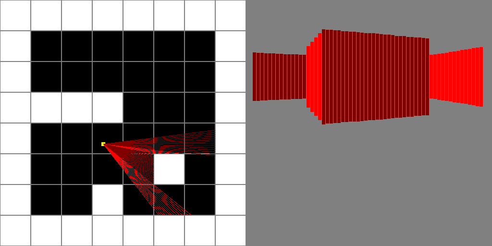

# Raycast básico

Pequeno estudo sobre a técnica de Raycast utilizada em jogos antigos como Wolfenstein 3D.

O código foi inteiramente baseado neste [tutorial](https://www.youtube.com/watch?v=gYRrGTC7GtA&t=558s "Tutorial do youtube") 

A seguir, algumas imagens do resultado atual do raycaster:

